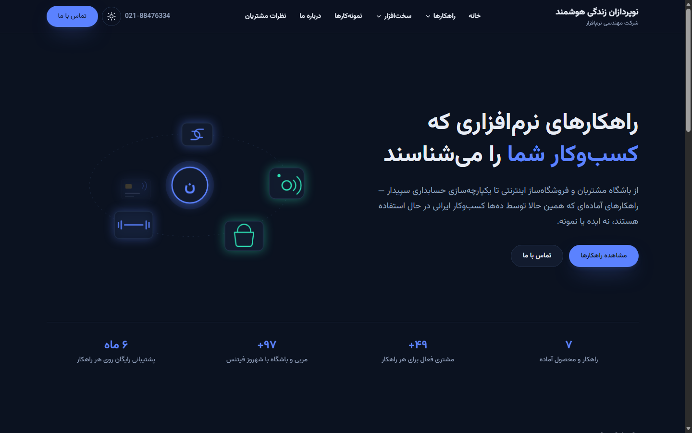

# Nopardazan Smart Living — Website

Company website redesign for **Nopardazan Smart Living** (نوپردازان زندگی هوشمند), rebuilt with Astro for maximum performance.

**[English](#english) | [فارسی](#فارسی)**

---

## English

### Screenshot



### About

A full redesign of the Nopardazan Smart Living corporate site, focused on performance: static output, self-hosted fonts, and content managed through typed Markdown collections (solutions, hardware, portfolio, testimonials).

### Tech Stack

- [Astro](https://astro.build) — static output
- Tailwind CSS v4
- Astro Content Collections for solutions, hardware, portfolio, and customer testimonials
- Vazirmatn font (self-hosted)

### Commands

| Command | Purpose |
| :--- | :--- |
| `npm install` | Install dependencies |
| `npm run dev` | Run the dev server at `localhost:4321` |
| `npm run build` | Build the production site to `./dist/` |
| `npm run preview` | Preview the production build |
| `npx astro check` | Check for TypeScript/template errors |

### Project Structure

```
src/
  components/   Reusable components (Header, Footer, Card, contact form, ...)
  content/      Solutions, hardware, portfolio, and testimonials content (Markdown)
  layouts/      Base site layout
  lib/          Shared helper functions
  pages/        Site pages and routes
public/         Static files (favicon, robots.txt)
```

### Deployment

Automatically published to GitHub Pages on every push to `main` (see `.github/workflows/deploy.yml`).

---

## فارسی

### تصویر


### درباره

بازطراحی کامل وب‌سایت شرکت نوپردازان زندگی هوشمند با Astro، با تمرکز بر بهترین پرفورمنس ممکن: خروجی استاتیک، فونت self-hosted و محتوای مدیریت‌شده از طریق Markdown Collectionهای تایپ‌شده (راهکارها، سخت‌افزار، نمونه‌کارها و نظرات مشتریان).

### پشته فناوری

- [Astro](https://astro.build) — خروجی استاتیک
- Tailwind CSS v4
- Astro Content Collections برای محتوای راهکارها، سخت‌افزار، نمونه‌کارها و نظرات مشتریان
- فونت وزیرمتن (self-hosted)

### دستورها

| دستور | کاربرد |
| :--- | :--- |
| `npm install` | نصب وابستگی‌ها |
| `npm run dev` | اجرای سرور توسعه روی `localhost:4321` |
| `npm run build` | ساخت نسخه نهایی در `./dist/` |
| `npm run preview` | پیش‌نمایش نسخه‌ی build‌شده |
| `npx astro check` | بررسی خطاهای TypeScript/تمپلیت |

### ساختار پروژه

```
src/
  components/   کامپوننت‌های قابل‌استفاده مجدد (Header، Footer، Card، فرم تماس و ...)
  content/      محتوای راهکارها، سخت‌افزار، نمونه‌کارها و نظرات مشتریان (Markdown)
  layouts/      Layout پایه سایت
  lib/          توابع کمکی مشترک
  pages/        صفحات و route‌های سایت
public/         فایل‌های استاتیک (favicon، robots.txt)
```

### استقرار

انتشار خودکار روی GitHub Pages با هر push به شاخه‌ی `main` (نگاه کنید به `.github/workflows/deploy.yml`).
